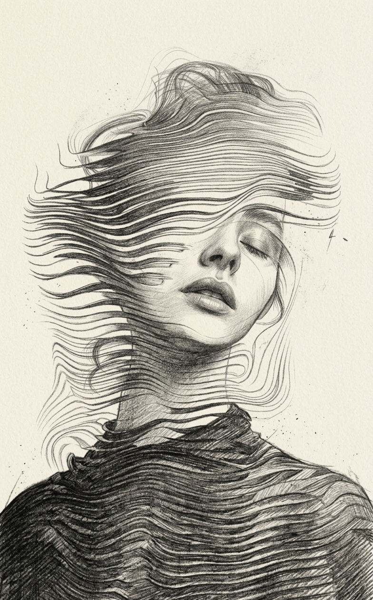

# 👨‍💻 Yousef Zedan | Creative Developer 🚀

  

---
### 🌌 About Me
I'm a **Software Developer** from Egypt. I don't just write code; I craft digital experiences. I believe in the **Right to Repair** and the power of **Open Source**.

- 🛠️ Currently mastering **React 19** & **Creative Web Development**.
- 🐧 **I Use Arch Btw With Hyprland BTW**
- 🎨 **Left-handed Artist:** I use my creative side to build better UIs.

---
### 🛠️ My Tech Stack

| 💻 Programming & Web | 🎨 Creative Arts (AV) | 🐧 System & Environment |
| :--- | :--- | :--- |
| **C** | **Digital Art** | **Ghostty Terminal** |
| **React 19 / JSX / TSX** | **DaVinci Resolve (Video)** | **Arch Linux (BTW)** |
| **TypeScript / JavaScript** | **FL Studio (Audio)** | **Hyprland (Tiling WM)** |
| **Tailwind CSS v4** | **Blender (3D Design)** | **Neovim / VS Code** |
| **HTML5 / CSS3** | **Traditional Sketching** | **Zen Browser** |
---

### 🎨 Creative Portfolio | Beyond the Code
When I'm not writing code, I'm crafting visual art. Being a **Traditional Artist** helps me build better User Interfaces with a creative edge.

  
  
  

---
### 📊 GitHub Stats

  

  

---

### 🎵 Current Vibe
> *"Code is like humor. When you have to explain it, it’s bad."*

---

### 📫 Connect with me

  
  
  
  
  
  

---

  

