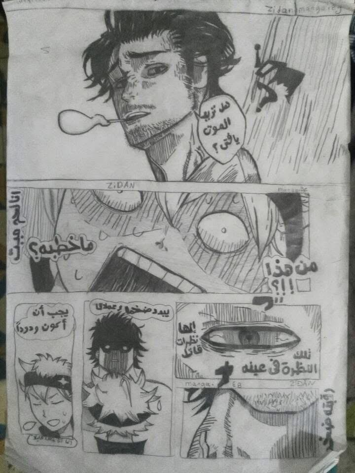
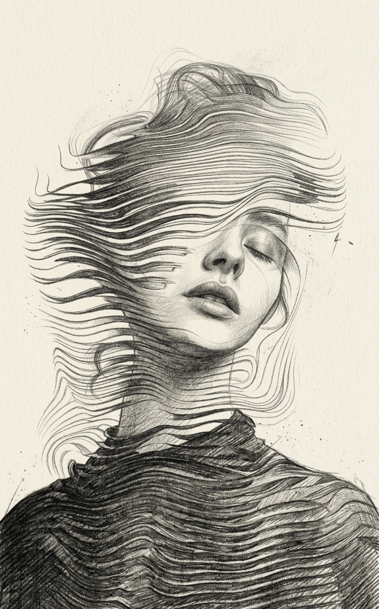

  <!-- Header Banner / Typing Animation -->
  

   

  

    

  <!-- Profile Views Badge -->
  

---

### 🌌 About Me

<table>
  <tr>
    <td width="100%" valign="top">
      
I'm a <b>Software Engineer</b> specializing in low-level desktop utilities, custom Linux environments, and high-performance interactive web applications. I bridge the gap between heavy C systems and modern, fluid visual experiences.

      <ul>
        <li>🛠️ <b>Open Source:</b> Active contributor to Wayland compositors like <a href="https://github.com/iluaii/fwm"><b>iluaii/fwm</b></a> (C / wlroots).</li>
        <li>📦 <b>Creator:</b> Built <a href="https://www.npmjs.com/package/zproximity-engine"><b>ZProximity Engine</b></a> — A physics-over-UI animation engine.</li>
        <li>🎨 <b>Creative Mind:</b> Traditional artist & audio producer applying classical design & geometry directly into modern UI/UX.</li>
      </ul>
</table>

---

### 🛠️ Tech Stack & Ecosystem

  <!-- Systems & Languages -->
  
  
  
  
  
  
  

   

  <!-- Environment & Tools -->
  
  
  
  
  

   

  <!-- Creative Suite -->
  
  
  

---

### 🎨 Creative Gallery
> *"Being a Traditional & Digital Artist shapes how I approach UI engineering — focusing on depth, geometry, and fluid motion rather than static layouts."*

  
  &nbsp;
  
  &nbsp;
  

---

### 📊 Analytics & Contributions

 

  

 

  

---

### 📫 Connect with Me

  
  &nbsp;
  
  &nbsp;
  
  &nbsp;
  
  &nbsp;
  

 
